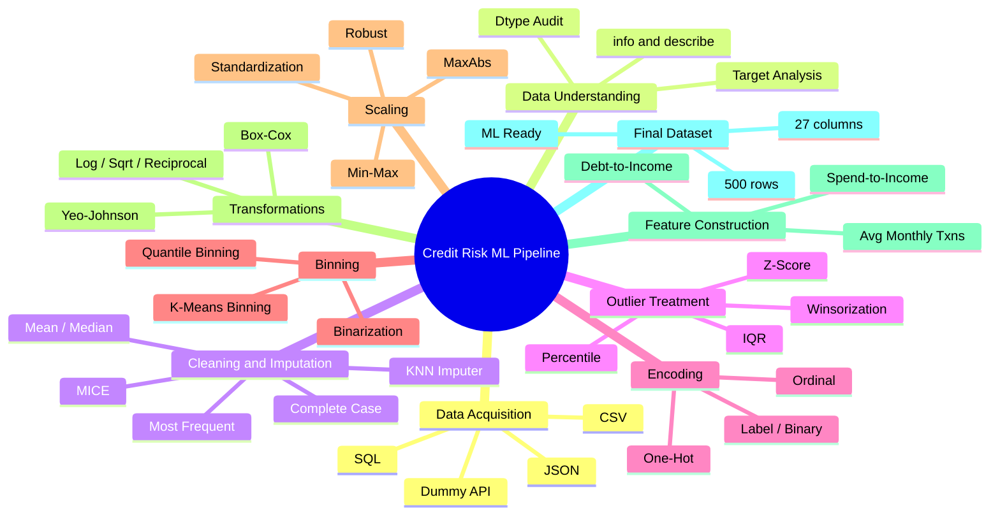
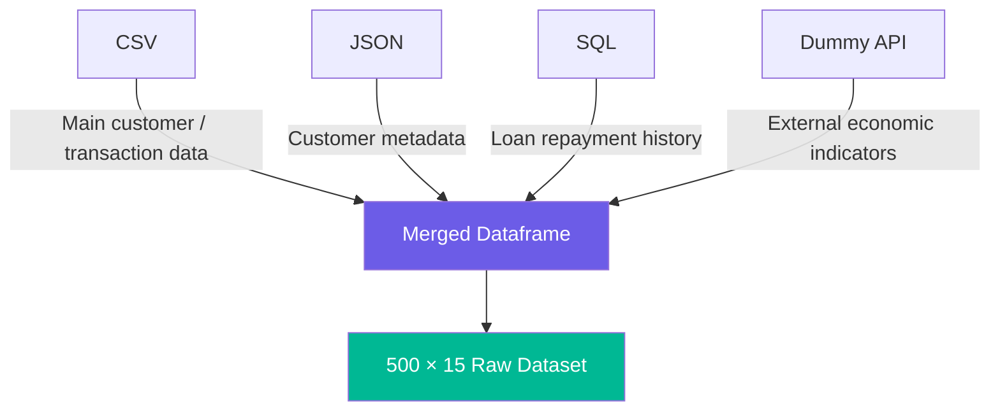
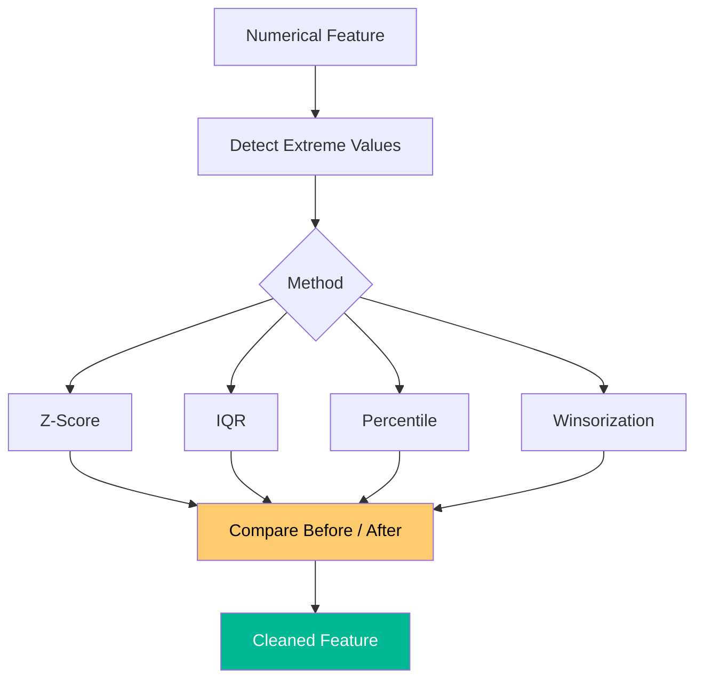
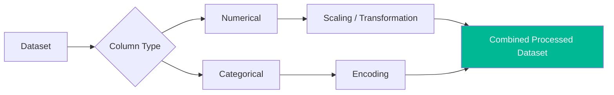
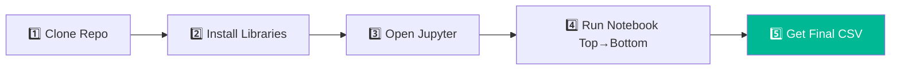
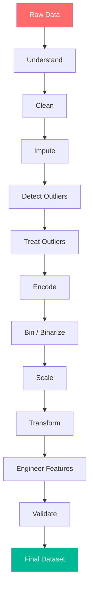

<div align="center">


<br/>


<br/>


<br/><br/>

**A complete academic Data Preprocessing + Feature Engineering project**
**based on a Customer Credit Risk dataset — from raw multi-source data to a fully ML-ready dataset.**

</div>

<br/>

## 📌 Table of Contents

| | | |
|---|---|---|
| [✨ Overview](#-project-overview) | [🧠 Mind Map](#-pipeline-mind-map) | [🎯 Problem Statement](#-problem-statement) |
| [📊 Dataset](#-dataset) | [📥 Data Acquisition](#-data-acquisition) | [🔎 Data Understanding](#-data-understanding) |
| [🧹 Cleaning & Missing Values](#-data-cleaning--missing-values) | [📉 Outlier Handling](#-outlier-handling) | [🔤 Encoding](#-feature-engineering--encoding) |
| [📦 Binning & Binarization](#-binning--binarization) | [📏 Feature Scaling](#-feature-scaling) | [🔄 Transformations](#-feature-transformations) |
| [🧩 ColumnTransformer](#-columntransformer) | [🧠 Constructed Features](#-constructed-features) | [📈 Column Growth](#-column-growth-breakdown) |
| [💾 Final Dataset](#-final-dataset) | [🗂️ Project Structure](#️-project-structure) | [🖼️ Visualizations](#️-visualizations) |
| [🚀 How to Run](#-how-to-run) | [📚 Techniques Covered](#-techniques-covered) | [🎓 Key Learnings](#-key-learnings) |
| [✅ Final Outcome](#-final-outcome) | [👨‍💻 Author](#-author) | [⭐ Support](#-support-this-project) |

<br/>

## ✨ Project Overview

This project demonstrates a **complete, end-to-end workflow** for preparing customer credit-risk data for Machine Learning.

The pipeline moves data through **12 structured stages** — from raw multi-source ingestion, through cleaning, imputation, outlier treatment, encoding, binning, scaling and transformation, all the way to engineered feature construction and a final ML-ready dataset.

> 🎯 **Project Objective:** Transform a raw **500 × 15** customer credit-risk dataset into a fully processed, **500 × 27** ML-ready dataset suitable for downstream modeling.

<br/>

## 🧠 Pipeline Mind Map

<div align="center">



</div>

### 🎬 Linear Workflow at a Glance


<br/>

## 🎯 Problem Statement

A fintech company provides customer credit-risk data collected from **multiple sources**. The goal is to prepare the data so a Machine Learning model can predict:

> **Will a customer default on a loan?**

| Target Variable | Value | Meaning |
|---|---|---|
| `default_flag` | `0` | No Default |
| `default_flag` | `1` | Default |

**Problem Type:** Binary Classification

<br/>

## 📊 Dataset

The **raw** Customer Credit Risk dataset contains:

**👤 Demographics** — Age • Gender • Region • Education Level • Employment Type
**💰 Financial Details** — Annual Income • Loan Amount • Loan Purpose • Credit Score
**📈 Behavioural Attributes** — Repayment History • Transaction Count • Spending Ratio
**🪪 Identifiers & Dates** — Customer ID • Join Date
**🎯 Target** — Default Flag

### 📐 Dataset Shape — Before vs After

| Stage | Rows | Columns | Notes |
|---|---|---|---|
| 📥 Raw Dataset (multi-source merge) | 500 | **15** | Original demographic + financial + behavioural fields |
| ⚙️ After Cleaning, Encoding, Binning & Construction | 500 | growing… | Encoding & feature construction add new columns |
| 💾 **Final ML-Ready Dataset** | 500 | **27** | Missing values = 0, Duplicates = 0 |

```
Raw Dataset            Final Dataset
┌─────────────┐        ┌─────────────┐
│  500 × 15   │  ───▶  │  500 × 27   │
└─────────────┘        └─────────────┘
   14 processing stages of cleaning, encoding & engineering
```

<br/>

## 📥 Data Acquisition

The project demonstrates data acquisition from **four different source types**, merged into a single working dataframe:



- **CSV** — primary customer & transaction records
- **JSON** — supplementary customer metadata
- **SQL** — loan repayment history table
- **Dummy API** — locally simulated external economic indicators

<br/>

## 🔎 Data Understanding

The dataset was explored using Pandas:

```python
df.info()
df.describe()
df.head()
```

Focus areas:
- Number of rows and columns (500 × 15)
- Data types (numerical vs categorical vs date)
- Missing values per column
- Basic statistical properties (mean, std, quartiles)
- Target variable balance (`default_flag`)

<br/>

## 🧹 Data Cleaning & Missing Values

| Technique | Purpose |
|---|---|
| Simple Imputer — Mean | Numerical missing values |
| Simple Imputer — Median | Numerical missing values (skewed data) |
| Simple Imputer — Most Frequent | Categorical missing values |
| Most Frequent Category Imputation | Categorical data |
| Missing Indicator + Random Sample | Preserve missingness information |
| KNN Imputer | Multivariate numerical imputation |
| MICE | Iterative multivariate imputation |
| Complete Case Analysis | Removing incomplete observations |

**Final Cleaning Result**

```
Missing values before  → Present across multiple columns
Missing values after   → 0
Duplicate rows         → 0
```

<br/>

## 📉 Outlier Handling

Four approaches were explored and compared:

| Method | Core Idea |
|---|---|
| **Z-Score** | Flag observations where `\|Z\| > 3` |
| **IQR** | `IQR = Q3 − Q1`, bounds = `Q1 − 1.5×IQR` / `Q3 + 1.5×IQR` |
| **Percentile** | Extreme values identified via percentile boundaries |
| **Winsorization** | Extreme values capped rather than deleted — preserves records |



<br/>

## 🔤 Feature Engineering & Encoding

### 🏷️ Mixed Variable Types
The dataset contains **numerical**, **categorical**, and **date** variables — each handled with an appropriate technique.

### 📅 Date & Time Features
`join_date` was decomposed into:

```
join_date  ──▶  join_year
            ──▶  join_month
            ──▶  join_day
            ──▶  join_weekday
```

### 🔢 Ordinal Encoding
Applied to `education_level` because categories have a natural order:

```
Primary → Secondary → Graduate → Post-Graduate
```

### 🏷️ Label / Binary Encoding
Binary-nature features (e.g. `gender`, `employment_type`) represented numerically as `0` / `1`.

### 🧱 One-Hot Encoding
Applied to nominal categorical variables:

```
region        → region_North, region_South, region_East, region_West
loan_purpose  → loan_purpose_Education, loan_purpose_Business, loan_purpose_Personal
```

Creates separate binary columns without imposing an artificial ranking.

<br/>

## 📦 Binning & Binarization

| Technique | Description |
|---|---|
| **Income Binning** | `Low` / `Medium` / `High` / `Very High` categories |
| **Quantile Binning** | Income divided into quantile-based groups |
| **K-Means Binning** | Income grouped using K-Means clustering |
| **Binarization** | `credit_score > 700 → high_credit_score = 1`, else `0` |

<br/>

## 📏 Feature Scaling

| Method | Main Idea |
|---|---|
| **Standardization** | Mean ≈ 0, Std ≈ 1 |
| **Normalization** | Scale observations to a common magnitude |
| **Min-Max Scaling** | Maps values to a `0–1` range |
| **MaxAbs Scaling** | Scales using maximum absolute value |
| **Robust Scaling** | Uses median and IQR — resistant to outliers |

**Why scale?**

```
Income        → hundreds of thousands
Loan Amount   → hundreds of thousands
Credit Score  → hundreds
```

Scaling makes numerical features comparable for magnitude-sensitive algorithms.

<br/>

## 🔄 Feature Transformations

**FunctionTransformer**

```python
from sklearn.preprocessing import FunctionTransformer

log_transform = FunctionTransformer(func=np.log1p)
sqrt_transform = FunctionTransformer(func=np.sqrt)
reciprocal_transform = FunctionTransformer(func=lambda x: 1 / (x + 1))
```

- Log Transform
- Reciprocal Transform
- Square Root Transform

**PowerTransformer**

```python
from sklearn.preprocessing import PowerTransformer

boxcox = PowerTransformer(method="box-cox")        # positive values only
yeojohnson = PowerTransformer(method="yeo-johnson") # handles zero & negative values
```

| Method | Requirement |
|---|---|
| **Box-Cox** | Requires strictly positive values |
| **Yeo-Johnson** | Handles zero and negative values |

<br/>

## 🧩 ColumnTransformer

Different preprocessing operations applied to different columns in a single unified workflow:



This keeps the preprocessing pipeline organized and production-ready for ML pipelines (`Pipeline` + `ColumnTransformer`).

<br/>

## 🧠 Constructed Features

| # | Feature | Formula | Meaning |
|---|---|---|---|
| 1 | **Debt-to-Income Ratio** | `loan_amount / annual_income` | Loan burden relative to income |
| 2 | **Average Monthly Transactions** | `transaction_count / 6` | Monthly average (6-month window) |
| 3 | **Spending-to-Income Ratio** | `spending_ratio` (retained) | Existing engineered spend/income signal |

<br/>

## 📈 Column Growth Breakdown

> A sample breakdown of how the dataset grows from **15 → 27** columns across the pipeline. Adjust the exact feature names below to match your own notebook.

| Stage | Change | Running Total |
|---|---|---|
| Raw dataset | — | **15** |
| `join_date` → year/month/day/weekday (drop original) | −1, +4 | 18 |
| `region` → one-hot (4 dummies, drop original) | −1, +4 | 21 |
| `loan_purpose` → one-hot (3 dummies, drop original) | −1, +3 | 23 |
| `income_bin` (quantile/K-Means bucket added) | +1 | 24 |
| `high_credit_score` (binarization flag) | +1 | 25 |
| `debt_to_income_ratio` (constructed) | +1 | 26 |
| `avg_monthly_transactions` (constructed) | +1 | **27** |

*(`education_level`, `gender`, `employment_type` are encoded **in place** — no new columns; `spending_ratio` is retained as-is.)*

<br/>

## 💾 Final Dataset

The final processed dataset was exported as:

```
final_cleaned_transformed_dataset.csv
```

<div align="center">

```
┌────────────────────────────────────┐
│           FINAL DATASET             │
├──────────────────────────────────────┤
│ Records          : 500              │
│ Original Columns : 15               │
│ Final Columns    : 27               │
│ Missing Values   : 0                │
│ Duplicates       : 0                │
│ Target           : default_flag     │
│ Status           : ✅ ML READY       │
└──────────────────────────────────────┘
```

</div>

<br/>

## 🗂️ Project Structure

```
customer-credit-risk/
│
├── 📓 Customer_Credit_Risk_Preprocessing.ipynb
│
├── 📊 data/
│   ├── customer_credit_risk_dataset.csv       # 500 × 15 raw
│   ├── customer_metadata.json
│   └── loan_repayment_history.sql
│
├── 🌐 api/
│   └── dummy_economic_api.py
│
├── 📁 output/
│   └── final_cleaned_transformed_dataset.csv  # 500 × 27 final
│
├── 🖼️ assets/
│   ├── workflow.png
│   └── preprocessing_workflow.gif
│
└── 📄 README.md
```

<br/>

## 🖼️ Visualizations

The notebook includes visual comparisons for preprocessing steps such as:

- 📊 Missing value heatmap — before vs after imputation
- 🔤 Encoding comparison — ordinal vs one-hot column expansion
- 📦 Binning distribution — quantile vs K-Means income buckets
- 📏 Scaling comparison — raw vs standardized/normalized features
- 🎯 Target class balance (`default_flag`)
- 🧮 Correlation heatmap of engineered features

> 💡 GitHub renders repository-hosted PNG/SVG/GIF files directly. Replace the placeholders in `assets/` with your actual exported notebook visuals.

<br/>

## 🚀 How to Run



**1. Clone the repository**
```bash
git clone <your-repository-url>
cd customer-credit-risk
```

**2. Install required libraries**
```bash
pip install pandas numpy scikit-learn matplotlib seaborn requests flask
```

**3. Open Jupyter Notebook**
```bash
jupyter notebook
```
Open `Customer_Credit_Risk_Preprocessing.ipynb`

**4. Run the notebook**
Run cells top to bottom so each preprocessing stage executes in sequence.

**5. Final output**
```
output/final_cleaned_transformed_dataset.csv   → 500 rows × 27 columns
```

<br/>

## 📚 Techniques Covered

<details>
<summary><b>Click to expand full technique list</b></summary>

<br/>

**Data Understanding**
- Pandas profiling · `info()` · `describe()` · Dataset inspection

**Missing Values**
- Mean/Median Imputation · Most Frequent Imputation · Random Sample Imputation · Missing Indicator · KNN Imputation · MICE · Complete Case Analysis

**Outlier Handling**
- Z-Score · IQR · Percentile · Winsorization

**Encoding**
- Ordinal Encoding · Label/Binary Encoding · One-Hot Encoding

**Numerical Feature Engineering**
- Quantile Binning · K-Means Binning · Binarization

**Scaling**
- Standardization · Normalization · Min-Max · MaxAbs · Robust Scaling

**Transformations**
- Log · Reciprocal · Square Root · Box-Cox · Yeo-Johnson

**Feature Construction**
- Debt-to-Income Ratio · Average Monthly Transactions · Spending-to-Income Ratio

**Pipeline-Oriented Processing**
- ColumnTransformer · sklearn Pipeline

</details>

<br/>

## 🎓 Key Learnings



This project demonstrates how raw customer data can be systematically converted into a structured, validated dataset suitable for Machine Learning modeling.

<br/>

## ✅ Final Outcome

The project successfully demonstrates a complete Data Preprocessing and Feature Engineering workflow for a Customer Credit Risk problem.

**Final deliverable: 500 records × 27 columns**

- ✅ Missing values handled (0 remaining)
- ✅ Duplicate rows checked (0 remaining)
- ✅ Outliers treated (Z-Score, IQR, Percentile, Winsorization)
- ✅ Categorical variables encoded (Ordinal, Label, One-Hot)
- ✅ Numerical features processed & scaled
- ✅ Required scaling methods demonstrated
- ✅ Required transformations demonstrated (Log, Box-Cox, Yeo-Johnson)
- ✅ Binning and binarization demonstrated
- ✅ New financial/behavioural features constructed
- ✅ Final CSV generated (`500 × 27`)
- ✅ Target variable preserved (`default_flag`)
- ✅ Dataset fully prepared for Machine Learning

<div align="center">

**DATA UNDERSTANDING → DATA CLEANING → FEATURE ENGINEERING → ML READINESS**

</div>

<br/>

## 👨‍💻 Author

<div align="center">

### **Roshan Marathe**
*Data Preprocessing • Feature Engineering • Machine Learning*


</div>

> ⚙️ Replace the GitHub/LinkedIn badge links above with your real profile URLs, and swap `Roshan-Marathe` in the view-counter with your actual GitHub username.

<br/>

## ⭐ Support This Project

If this project helped you understand the complete preprocessing workflow, consider **starring the repository** ⭐

<div align="center">


</div>
