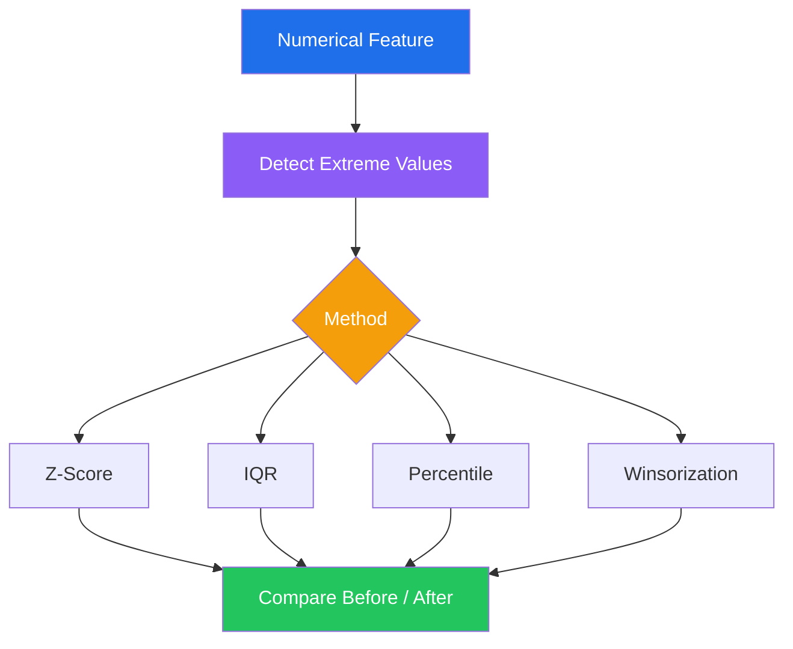
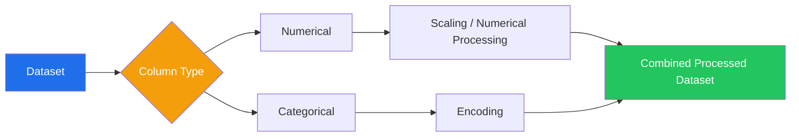

<div align="center">

<!-- Animated typing header -->


<br/>

<!-- Badge row -->


<br/><br/>


<h3>🏦 An End-to-End Data Preprocessing &amp; Feature Engineering Pipeline for Machine Learning</h3>
<p><i>Turning raw, messy, multi-source financial data into a clean, structured, ML-ready dataset.</i></p>

</div>

<br/>

<!-- Animated mind-map hero -->
<div align="center">
  
  <br/>
  <sub><b>⚡ Live build-up of the full preprocessing pipeline — generated directly from this project's workflow</b></sub>
</div>

<br/>

<div align="center">

### 📌 Quick Navigation

</div>

<details open>
<summary><b>📚 Table of Contents</b></summary>
<br/>

- [✨ Project Overview](#-project-overview)
- [🎬 Workflow at a Glance](#-workflow-at-a-glance)
- [🎯 Problem Statement](#-problem-statement)
- [📊 Dataset](#-dataset)
- [📥 Data Acquisition](#-data-acquisition)
- [🔎 Data Understanding](#-data-understanding)
- [🧹 Data Cleaning & Missing Values](#-data-cleaning--missing-values)
- [📉 Outlier Handling](#-outlier-handling)
- [🔤 Feature Engineering & Encoding](#-feature-engineering--encoding)
- [📦 Binning & Binarization](#-binning--binarization)
- [📏 Feature Scaling](#-feature-scaling)
- [🔄 Feature Transformations](#-feature-transformations)
- [🧩 ColumnTransformer](#-columntransformer)
- [🧠 Constructed Features](#-constructed-features)
- [🧭 Advanced Pipeline Mind Map](#-advanced-pipeline-mind-map)
- [💾 Final Dataset](#-final-dataset)
- [🗂️ Project Structure](#️-project-structure)
- [🚀 How to Run](#-how-to-run)
- [📚 Techniques Covered](#-techniques-covered)
- [🎓 Key Learnings](#-key-learnings)
- [✅ Final Outcome](#-final-outcome)
- [👨‍💻 Author](#-author)

</details>

<br/>

## ✨ Project Overview

This project demonstrates a **complete, end-to-end workflow** for preparing customer credit-risk data for Machine Learning.

The pipeline moves from raw multi-source data understanding → cleaning → imputation → outlier treatment → encoding → scaling → transformations → feature construction → **final ML-ready data**.

> 🎯 **Objective:** Prepare a fully processed Customer Credit Risk dataset suitable for downstream Machine Learning modeling.

<br/>

## 🎬 Workflow at a Glance


<br/>

## 🎯 Problem Statement

A fintech company provides customer credit-risk data collected from multiple sources. The goal is to prepare the data so that a Machine Learning model can predict:

> **Will a customer default on a loan?**

<div align="center">

| Target Variable | Value | Meaning        |
|:----------------:|:-----:|:---------------|
| `default_flag`   | `0`   | No Default      |
| `default_flag`   | `1`   | Default         |

**Problem Type:** `Binary Classification`

</div>

<br/>

## 📊 Dataset

The Customer Credit Risk dataset contains:

<table>
<tr>
<td valign="top" width="33%">

**👤 Demographics**
- Age
- Gender
- Region
- Education Level
- Employment Type

</td>
<td valign="top" width="33%">

**💰 Financial Details**
- Annual Income
- Loan Amount
- Loan Purpose
- Credit Score

</td>
<td valign="top" width="33%">

**📈 Behavioural Attributes**
- Repayment History
- Transaction Count
- Spending Ratio

</td>
</tr>
</table>

**🎯 Target:** `default_flag`

### Dataset Snapshot

| Property        | Final Result   |
|:-----------------|:--------------:|
| Records           | `500`           |
| Final Columns     | `34`            |
| Missing Values    | `0`             |
| Duplicate Rows    | `0`             |
| Target            | `default_flag`  |

<br/>

## 📥 Data Acquisition

The project demonstrates data acquisition and integration from **multiple heterogeneous sources**:

```
CSV   ──▶  Main customer / transaction data
JSON  ──▶  Customer metadata
SQL   ──▶  Loan repayment history
API   ──▶  External economic indicators (dummy API)
```

| Source | Contents |
|:------:|:---------|
| 📄 CSV | Main customer/transaction data |
| 🧾 JSON | Customer metadata |
| 🗄️ SQL | Loan repayment history |
| 🌐 Dummy API | External economic indicators |

<br/>

## 🔎 Data Understanding

The dataset was explored using Pandas:

```python
df.info()
df.describe()
df.head()
```

**Objectives:**
- Number of rows and columns
- Data types
- Numerical vs categorical variables
- Missing values
- Basic statistical properties
- Target variable distribution

<br/>

## 🧹 Data Cleaning & Missing Values

| Technique | Purpose |
|:----------|:--------|
| Simple Imputer — Mean | Numerical missing values |
| Simple Imputer — Median | Numerical missing values |
| Simple Imputer — Most Frequent | Categorical missing values |
| Most Frequent Category Imputation | Categorical data |
| Missing Indicator + Random Sample | Preserve missingness information |
| KNN Imputer | Multivariate numerical imputation |
| MICE | Iterative multivariate imputation |
| Complete Case Analysis | Removing incomplete observations |

<div align="center">

**Missing values before → Present&nbsp;&nbsp;&nbsp;|&nbsp;&nbsp;&nbsp;Missing values after → `0`**

</div>

<br/>

## 📉 Outlier Handling

Four detection/treatment approaches were explored:

<table>
<tr><td width="50%">

**1️⃣ Z-Score Method**
Flags observations with unusually large standardized values.
```
|Z| > 3 → potential outlier
```

**2️⃣ IQR Method**
```
IQR = Q3 − Q1
Lower Bound = Q1 − 1.5 × IQR
Upper Bound = Q3 + 1.5 × IQR
```

</td><td width="50%">

**3️⃣ Percentile Method**
Extreme observations identified using percentile boundaries.

**4️⃣ Winsorization**
Extreme values capped rather than deleted, preserving customer records.

</td></tr>
</table>



<br/>

## 🔤 Feature Engineering & Encoding

### 🏷️ Mixed Variable Types
The project handles **numerical**, **categorical**, and **date** variables.

### 📅 Date & Time Features
`join_date` was decomposed into:
```
join_year   |   join_month   |   join_day   |   join_weekday
```

### 🔢 Ordinal Encoding
Applied to `education_level`, since categories have a natural order:

```
Primary → Secondary → Graduate → Post-Graduate
```

### 🏷️ Label / Binary Encoding
Binary features represented numerically using `0` and `1`.

### 🧱 One-Hot Encoding
Applied to nominal categorical variables such as `region` and `loan_purpose`, creating separate binary columns without imposing artificial rank.

<br/>

## 📦 Binning & Binarization

| Technique | Description |
|:----------|:------------|
| **Income Binning** | `Low` → `Medium` → `High` → `Very High` |
| **Quantile Binning** | Income divided into quantile-based groups |
| **K-Means Binning** | Income grouped using K-Means clustering |
| **Binarization** | `credit_score > 700` → `high_credit_score = 1`, else `0` |

<br/>

## 📏 Feature Scaling

| Method | Main Idea |
|:-------|:----------|
| Standardization | Mean ≈ 0, Std ≈ 1 |
| Normalization | Scale observations to a common magnitude |
| Min-Max Scaling | Commonly maps values to `[0, 1]` |
| MaxAbs Scaling | Scales using the maximum absolute value |
| Robust Scaling | Uses median and IQR (outlier-resistant) |

**Why scaling?** Numerical variables differ hugely in magnitude:

```
Income        → hundreds of thousands
Loan Amount   → hundreds of thousands
Credit Score  → hundreds
```

Scaling makes features comparable for magnitude-sensitive algorithms.

<br/>

## 🔄 Feature Transformations

**FunctionTransformer**
- Log Transform
- Reciprocal Transform
- Square Root Transform

```python
from sklearn.preprocessing import FunctionTransformer
```

**PowerTransformer**
- Box-Cox — *requires strictly positive values*
- Yeo-Johnson — *handles zero and negative values*

<br/>

## 🧩 ColumnTransformer

Different preprocessing operations applied to different columns in a single unified workflow:



This keeps the preprocessing workflow organized and production-pipeline-ready.

<br/>

## 🧠 Constructed Features

| # | Feature | Formula | Meaning |
|:-:|:--------|:--------|:--------|
| 1 | **Debt-to-Income Ratio** | `loan_amount / annual_income` | Loan burden relative to income |
| 2 | **Average Monthly Transactions** | `transaction_count / 6` | Monthly average (6-month window) |
| 3 | **Spending-to-Income Ratio** | `spending_ratio` (retained) | Existing engineered spending signal |

<br/>

## 🧭 Advanced Pipeline Mind Map

A full radial mind map of the entire preprocessing pipeline — every stage, every technique, branching from the core problem:

<div align="center">
  
</div>

<div align="center">
<sub>Static high-resolution version — see the animated build-up at the top of this README (<code>assets/preprocessing_workflow.gif</code>)</sub>
</div>

### 🖼️ Additional Visualization Assets

The notebook includes visual comparisons for each preprocessing step:

- Before vs. After outlier treatment
- Z-Score outlier detection
- IQR outlier treatment
- Winsorization effect
- Distribution transformations (Log, Box-Cox, Yeo-Johnson)
- Scaling comparisons

**Suggested repository layout for visuals:**

```
assets/
├── workflow.png                     # 🧭 mind-map overview (included)
├── preprocessing_workflow.gif       # 🎞️ animated pipeline build-up (included)
├── outliers/
│   ├── zscore_before_after.png
│   ├── iqr_before_after.png
│   └── winsorization_before_after.png
├── transformations/
│   ├── log_transform.png
│   ├── boxcox.png
│   └── yeojohnson.png
└── final/
    └── dataset_snapshot.png
```

> 💡 GitHub renders repository-hosted PNG/SVG/GIF files directly — export your notebook's plots into `assets/` using the structure above to keep this README fully self-contained.

<br/>

## 💾 Final Dataset

The final processed dataset was exported as `final_cleaned_transformed_dataset.csv`.

<div align="center">

```
┌──────────────────────────────┐
│        FINAL DATASET         │
├──────────────────────────────┤
│ Records        : 500         │
│ Columns        : 34          │
│ Missing Values : 0           │
│ Duplicates     : 0           │
│ Target         : default_flag│
│ Status         : ML READY ✅ │
└──────────────────────────────┘
```

</div>

<br/>

## 🗂️ Project Structure

```
customer-credit-risk/
│
├── 📓 Customer_Credit_Risk_Preprocessing.ipynb
│
├── 📊 data/
│   ├── customer_credit_risk_dataset.csv
│   ├── customer_metadata.json
│   └── loan_repayment_history.sql
│
├── 🌐 api/
│   └── dummy_economic_api.py
│
├── 📁 output/
│   └── final_cleaned_transformed_dataset.csv
│
├── 🖼️ assets/
│   ├── workflow.png
│   ├── preprocessing_workflow.gif
│   ├── outliers/
│   ├── transformations/
│   └── final/
│
└── 📄 README.md
```

<br/>

## 🚀 How to Run

<table>
<tr><td width="5%" align="center"><b>1</b></td><td>

**Clone the repository**
```bash
git clone <your-repository-url>
cd customer-credit-risk
```

</td></tr>
<tr><td align="center"><b>2</b></td><td>

**Install required libraries**
```bash
pip install pandas numpy scikit-learn matplotlib seaborn requests flask
```

</td></tr>
<tr><td align="center"><b>3</b></td><td>

**Launch Jupyter Notebook**
```bash
jupyter notebook
```

</td></tr>
<tr><td align="center"><b>4</b></td><td>

**Open and run**
Open `Customer_Credit_Risk_Preprocessing.ipynb` and run all cells top-to-bottom so each preprocessing stage executes in sequence.

</td></tr>
<tr><td align="center"><b>5</b></td><td>

**Get your output**
```
output/final_cleaned_transformed_dataset.csv
```

</td></tr>
</table>

<br/>

## 📚 Techniques Covered

<details>
<summary><b>Click to expand the full technique checklist ✅</b></summary>
<br/>

**Data Understanding**
- [x] Pandas profiling
- [x] `info()`, `describe()`
- [x] Dataset inspection

**Missing Values**
- [x] Mean / Median Imputation
- [x] Most Frequent Imputation
- [x] Random Sample Imputation
- [x] Missing Indicator
- [x] KNN Imputation
- [x] MICE
- [x] Complete Case Analysis

**Outlier Handling**
- [x] Z-Score
- [x] IQR
- [x] Percentile
- [x] Winsorization

**Encoding**
- [x] Ordinal Encoding
- [x] Label / Binary Encoding
- [x] One-Hot Encoding

**Numerical Feature Engineering**
- [x] Equal-width / Quantile Binning
- [x] K-Means Binning
- [x] Binarization

**Scaling**
- [x] Standardization
- [x] Normalization
- [x] Min-Max
- [x] MaxAbs
- [x] Robust Scaling

**Transformations**
- [x] Log, Reciprocal, Square Root
- [x] Box-Cox
- [x] Yeo-Johnson

**Feature Construction**
- [x] Debt-to-Income Ratio
- [x] Average Monthly Transactions
- [x] Spending-to-Income Ratio

**Pipeline-Oriented Processing**
- [x] ColumnTransformer

</details>

<br/>

## 🎓 Key Learnings

This project demonstrates how raw customer data can be systematically converted into a structured dataset suitable for Machine Learning:

```
Raw Data → Understand → Clean → Impute → Detect Outliers → Treat Outliers
→ Encode → Bin / Binarize → Scale → Transform → Engineer Features
→ Validate → Final Dataset
```

<br/>

## ✅ Final Outcome

<div align="center">

| ✅ | Deliverable |
|:--:|:------------|
| ✅ | Missing values handled |
| ✅ | Duplicate rows checked |
| ✅ | Outliers treated |
| ✅ | Categorical variables encoded |
| ✅ | Numerical features processed |
| ✅ | Required scaling methods demonstrated |
| ✅ | Required transformations demonstrated |
| ✅ | Binning and binarization demonstrated |
| ✅ | New financial / behavioural features constructed |
| ✅ | Final CSV generated |
| ✅ | Target variable preserved |
| ✅ | Dataset prepared for Machine Learning |

**Final deliverable: `500 records × 34 columns` — fully ML-ready.**

</div>

<br/>

<div align="center">

### ⭐ Project Status

**DATA UNDERSTANDING → DATA CLEANING → FEATURE ENGINEERING → ML READINESS**

*Built as a complete Data Preprocessing & Feature Engineering academic project.*

</div>

<br/>

## 👨‍💻 Author

<div align="center">

### Roshan Marathe

*Data Preprocessing • Feature Engineering • Machine Learning*

<a href="#"></a>
<a href="#"></a>
<a href="#"></a>

<sub>👆 Replace the links above with your own profile URLs.</sub>

</div>

<br/>

<div align="center">

### ⭐ If this project helped you understand the complete preprocessing workflow, consider starring the repository!


<br/><br/>

**[⬆ Back to Top](#)**

</div>
